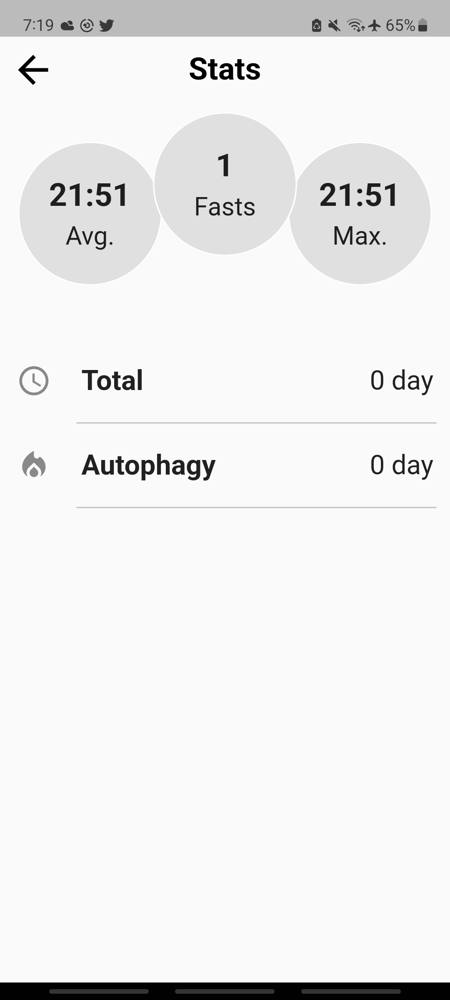
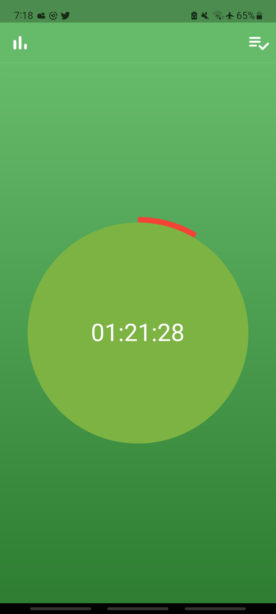

# Fast Buddy

(In the process of being rewritten using the BLoC design pattern)

Fast Buddy is a minimalist fasting companion app designed to help users track and achieve their fasting goals. Fasting has been shown to offer a range of health benefits, from improved insulin sensitivity to reduced inflammation, making it an increasingly popular wellness practice. [Read about it.](https://acsjournals.onlinelibrary.wiley.com/doi/full/10.3322/caac.21694)

Unlike other fasting apps, which rely on timers that simply count down until the fasting period is over, Fast Buddy employs a stopwatch to offer greater flexibility and precision in your tracking. 

The app features three screens : 

- The first allows users to start and monitor their current fast.
- The second provides an history of past fasting sessions.
- The third summarizes key statistics.

One of Fast Buddy's standout features is its red circular indicator, which tracks progress towards autophagy, a state of cellular cleansing that occurs during extended fasting periods. I will be adding features in the future.

  

